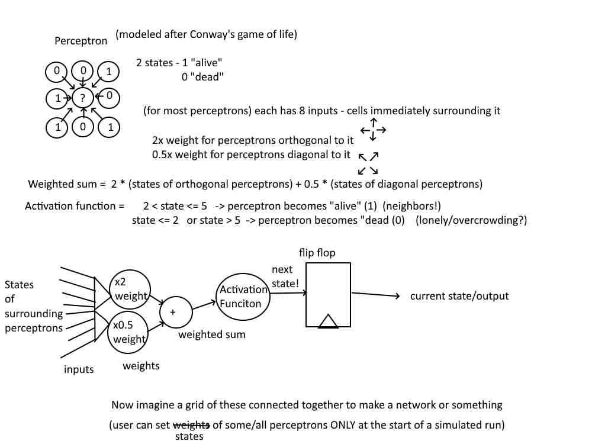
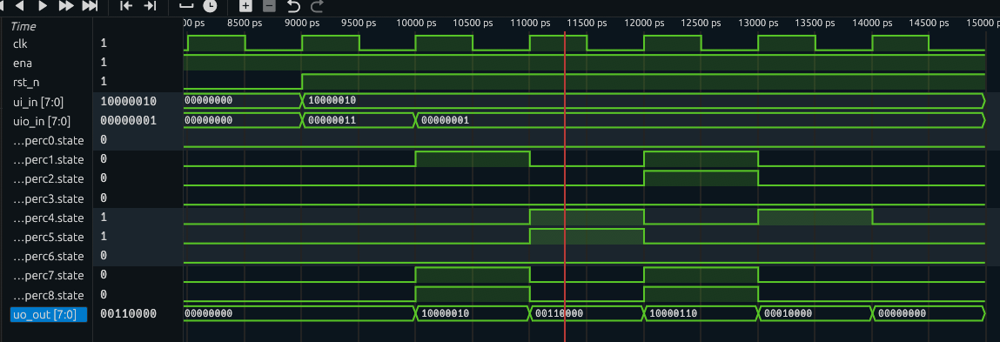
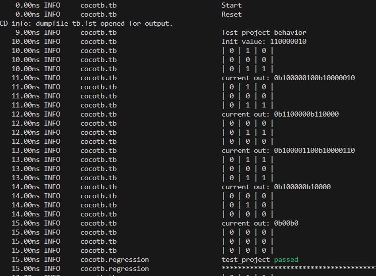

These verilog files and tiny-tapeout components create a perceptron-powered version of
Conway's Game of Life!
(in a 3x3 grid)

In perc.v is the actual code for each perceptron.

The perceptron takes in inputs from the surrounding perceptrons (4 orthogonal, 4 diagonal, some values are
zeroed out for perceptrons on the edge of the grid). These inputs are multiplied by the weights inside perc.v, where orthogonal perceptrons
have 4 times more effect on the perceptron's next state than diagonal ones. Once this weighted sum is calculated, if the weighted sum is within
the perceptron's "goldilocks zone" (between 4 and 10 for these perceptrons), the perceptron will be 'alive' in the next state! Otherwise,
(to simulate loneliness or overcrowding) the perceptron will be 'dead' next round. After reset is done, a bit is used to hold the perceptron's
in an init hold state, where the initial states can be passed through the ui_in channels. After the uio_in bit goes low, the perceptrons can
start taking in inputs and changing state, simulating a version of Conways Game of Life!

In tt_um_perc.v, all the perceptrons are individually instantiated and are wired together, the outputs of the orthogonal and 
diagonal perceptrons feeding into the inputs of others.
If we had a bigger ui_in stack, we could simulate larger games (4x4, 5x5, etc.)

In test.py we simulate a game with inputs!

With the inputs in ui_in (and the 0th bit of uio_in), we set the initial state of the perceptrons, and after reset
and the init bit are done, the game begins! The for loop runs through each iteration of the game one clock cycle
at a time, allowing easy adjustment of how long the game should go on for. Also the _log.info print statements give
a clear visual indicator of how the game is going!

This did take a lot of debugging as this ended up being a bit (a lot) more complicated than just a single perceptron (I couldn't think
of a use for a single perceptron so I ended up making an array of them to simulate something!). All the perceptrons having to be wired to
other perceptrons made for quite the convoluted top module and wiring but it seems to have all worked out! Thank god I have experience with
Verilog from past classes. But it was fun to do, it's was cool seeing it all come together! 